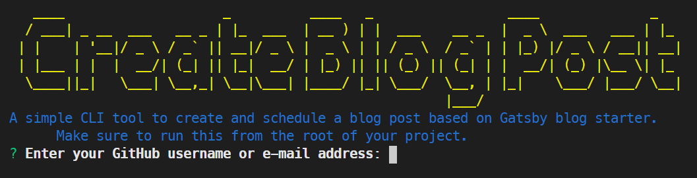

<p align="center"></p>

# Gatsby Blog Post Scheduler

[](https://www.npmjs.com/package/gatsby-blog-post-scheduler)
[](https://www.npmjs.com/package/gatsby-blog-post-scheduler)
[](http://hits.dwyl.com/Gabri3l/gatsby-blog-post-scheduler)

A simple CLI to generate and schedule a blog post.

## Getting Started

This project was born to automate the creation and publication of blog posts for Gatsby blog starter. I've been trying to commit myself to publish a new article every monday. Sometimes I have more to write, sometimes I just don't have the time. In order to make the best out of more productive weeks, I automated the process of generating a blog post template and schedule its publication at a specified date.

### Prerequisites

This CLI was developed to go along with the `gatsby-starter-blog` package. You can find it [here](https://www.gatsbyjs.org/starters/gatsbyjs/gatsby-starter-blog/). Or you can install it locally with the following command:

```shell
gatsby new gatsby-starter-blog https://github.com/gatsbyjs/gatsby-starter-blog
```

In order for the scheduling to work there are a few other requirements. First of all make sure you auto release your blog for every new commit to your master branch. I personally use [Netlify](https://www.netlify.com/) which offers this out of the box.

I then added the [Merge Schedule](https://github.com/marketplace/actions/merge-schedule) Github action to automatically merge a PR at a given date.

To recap the requirements are:

-  [Gatsby starter blog](https://www.gatsbyjs.org/starters/gatsbyjs/gatsby-starter-blog/)
-  [Netlify](https://www.netlify.com/) (or any other service that allows auto release on commits to master)
-  [Merge Schedule](https://github.com/marketplace/actions/merge-schedule) Github Action

### Installing

You can either install this CLI globally:

```shell
npm i -g gatsby-blog-post-scheduler
```

or run it directly as

```shell
npx gatsby-blog-post-scheduler
```

## How to Use

If you installed the CLI globally you can go to the root folder of your blog and run the simple command:

```shell
schedule-blog-post
```

On your first use you will be required to enter your Github credentials. This process will save a token on your local machine so you can submit PR automatically via the CLI.



After a successful login, you will be prompted with a few questions to draft your blog post. Once you're done a new branch is created that will be merged to master at the specified date (which you'll provide in one of the questions).

After that...go ahead and write your post! :tada:

## Contributing

Please read [CONTRIBUTING.md]() for details on our code of conduct, and the process for submitting pull requests to us.

## Versioning

We use [SemVer](http://semver.org/) for versioning. For the versions available, see the [tags on this repository](https://github.com/Gabri3l/gatsby-blog-post-scheduler/tags).

## License

This project is licensed under the MIT License - see the [LICENSE](LICENSE) file for details
